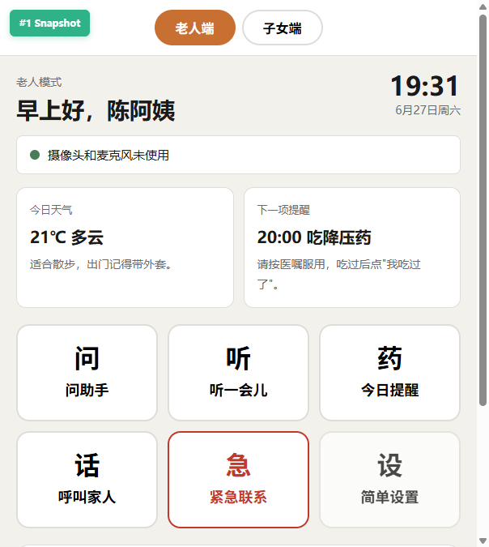
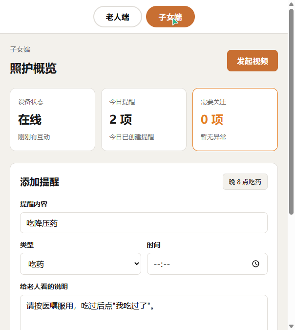
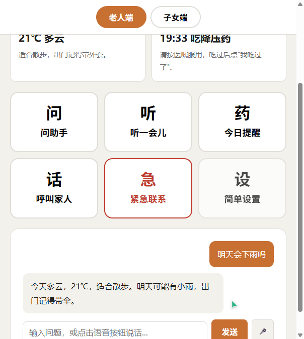
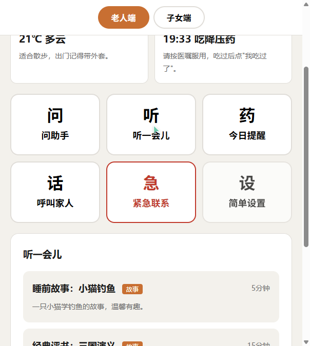
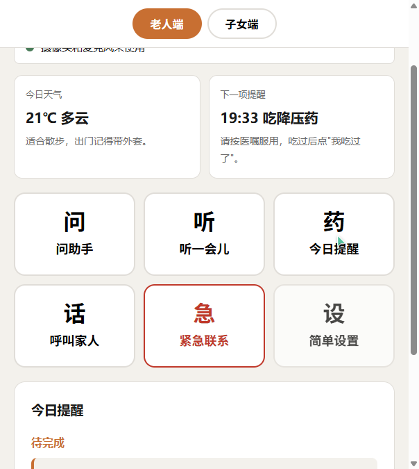
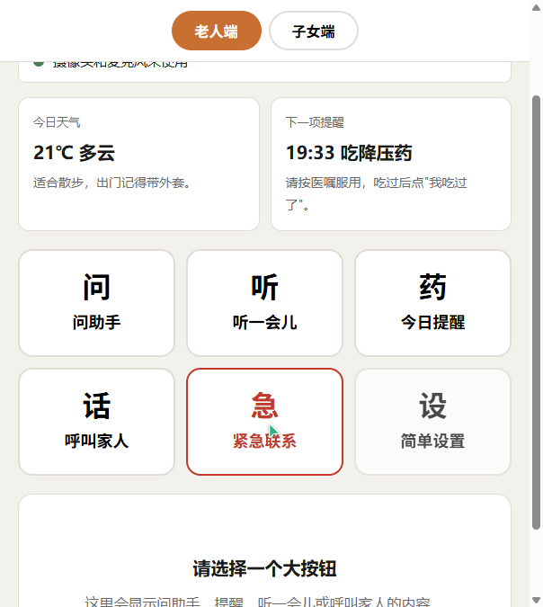
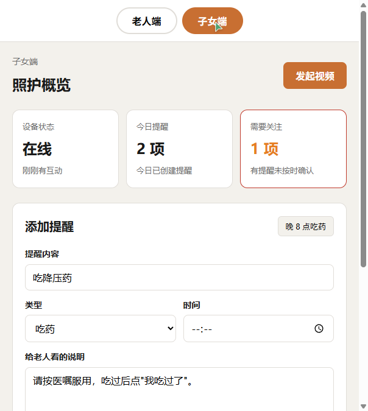

# 安心小屏

安心小屏是一款把闲置旧安卓手机改造成老人桌面陪伴屏的纯前端 Demo，通过大字体、大按钮和语音交互降低使用门槛。

在线演示：<https://anxin-xiaoping-demo.vercel.app>（如比赛提交链接变更，可在此替换）

## 核心功能

- 老人端桌面陪伴屏：显示时间、天气、下一项提醒，并提供大按钮入口。
- 提醒系统：子女端添加提醒，老人端到点弹窗确认，状态在同浏览器多标签页间同步。
- AI 问助手：支持文字输入和本地语音识别入口，用大字回答天气、时间、常识类问题。
- 娱乐陪伴：提供故事、戏曲、广播等轻量陪伴内容入口。
- 紧急联系：老人可一键查看或呼叫预设联系人。
- 视频通话：演示从子女端呼叫、老人端接听到通话中隐私状态提示的完整流程。

## 项目截图

| 老人端首页 | 子女端概览 | AI 问助手 |
| --- | --- | --- |
|  |  |  |

| 娱乐陪伴 | 今日提醒 | 紧急联系 |
| --- | --- | --- |
|  |  |  |

| 来电提醒 | 通话中 | 添加提醒 |
| --- | --- | --- |
|  |  |  |

## 技术栈

- 前端：HTML、CSS、原生 JavaScript
- 应用形态：PWA 网页应用，浏览器打开即用
- 状态同步：BroadcastChannel，用于同一浏览器内老人端与子女端演示联动
- 视频通话：WebRTC 前端流程演示，可选 WebSocket 信令服务器位于 `server/`
- 服务端：`server/` 目录为可选信令服务器，不影响静态页面部署

## 本地运行

前端代码位于 `src/`，可用任意静态服务器打开：

```bash
cd src
npx serve .
```

也可以使用 Python 内置静态服务器：

```bash
cd src
python -m http.server 8080
```

打开浏览器访问本地地址后，可在页面顶部切换“老人端”和“子女端”。

如需运行可选信令服务器：

```bash
cd server
npm install
npm start
```

## Vercel 部署配置

这是纯静态前端项目，部署到 Vercel 时建议使用以下设置：

- Framework Preset: Other
- Root Directory: `src`
- Build Command: 留空
- Output Directory: 留空

`src/vercel.json` 提供了静态站点的基础配置。

## 项目结构

```
anxin-xiaoping-demo/
├── src/                    # 前端源代码，也是 Vercel 静态部署根目录
│   ├── index.html          # 主入口 (老人端 + 子女端切换)
│   ├── manifest.webmanifest # PWA 应用信息
│   ├── css/
│   │   └── main.css        # 主样式
│   ├── js/
│   │   ├── app.js          # 主应用逻辑
│   │   ├── elder.js        # 老人端模块
│   │   ├── family.js       # 子女端模块
│   │   ├── reminders.js    # 提醒系统
│   │   ├── assistant.js    # AI 问助手
│   │   ├── entertainment.js # 娱乐陪伴
│   │   ├── webrtc.js       # 视频通话
│   │   └── state.js        # 状态管理
│   ├── vercel.json         # Vercel 静态部署配置
│   └── assets/
│       └── images/         # 截图与图片资源
├── server/                 # 服务端 (信令 + AI 代理)
│   ├── package.json
│   └── index.js
├── docs/                   # 文档
└── README.md
```

## 演示流程

1. 子女在子女端设置"晚上 8 点吃降压药"提醒
2. 老人端到点弹出大字提醒 + 语音播报
3. 老人点击"我吃过了"确认
4. 子女端实时看到"已确认"状态
5. 老人询问"明天会下雨吗"，AI 用大字和语音回复
6. 老人点击"听一会儿"，播放一段故事
7. 子女发起视频通话
8. 老人端显示来电人，点击接听，屏幕显示隐私提示
9. 通话结束回到首页，隐私状态恢复

## 许可证

MIT
